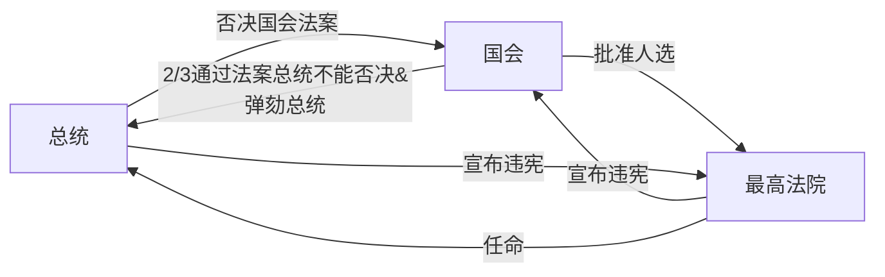

- 三权分立：立法权、司法权、行政权
- 亚里士多德，政体三要素：议事权、行政权、审判权
- 洛克《政府论》：立法权----议会。行政权、对外权----国王
# 美国总统制：
总统、国会、最高法院

# 英国内阁制
## 上议院
- 贵族院
    - 王室后裔、世袭贵族、新封贵族、上诉法院法官、教会
- 司法机关
    - 议长由大法官兼任，又是法律大臣
## 下议院
- 平民院、众议院
    - 选举产生
- 立法权、财政权、行政监督权

提出议案→议会辩论→经三读通过→上议院→英王

# 孙中山五权宪法：
立法权、行政权、司法权、监察权、考试权

平等和自由是天敌。少数人的自由和多数人的平等是矛盾的。
