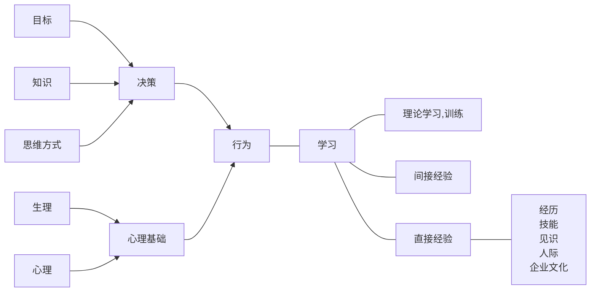

# 史前积累
# 古典管理理论
## 泰罗
- 科学管理的中心问题是提高劳动生产率
- 需要挑选一流的工人。（所谓一流的工人，是适合某种工作，并且愿意努力的人
- 标准化
- 刺激性报酬
- “精神革命”：双方合作，共同“把蛋糕做大”
- 计划职能和执行职能分开。科学方法代替经验方法
- 职能工长制，细化生产过程
- 例外原则。日常事务授权部下负责，管理人员只对例外（重大）事项保留处置权

## 法约尔
### 六种经营活动：
1. 技术活动（生产）
2. 商业活动（交换）
3. 财务活动
4. 安全活动
5. 会计活动
6. 管理活动

### 五大管理职能：
- 计划
- 组织
- 指挥
- 协调
- 控制

### 14个原则
- 劳动分工原则
- 权力与责任对等原则
- 纪律原则
- 统一指挥原则
- 统一领导原则
- 个人利益服从整体利益原则
- 员工报酬原则
- 集权原则
- 等级系列原则
- 秩序原则
- 公平原则
- 人员稳定
- 首创精神

## 马克斯
- 规定每个岗位的权力与责任
- 按照不同职位的权力大小，形成有序的等级系统，以制度巩固下来
- 明确规定职位特性
- 权力从属于地位，服从于制度，而不是某个人
- 每人都拥有执行自己职能所必要的权力。权力严格限制
- 管理者的职务是他的职业，忠于职守，而不是忠于某个人

# 行为和学习是个体的两个基本特征

# 现代观点
1. 管理是组织的特殊器官
2. 管理的实质是协调
3. 是有意识的协调
4. 是维持机体协作延续发展的行为

正式组织的三要素：
1. 协作意愿
2. 共同目标*是吗？现代社会表示怀疑*
3. 信息沟通

# 企业环境
能动性：
1. 一定范围内选择行业、地区
2. 创造与影响环境

什么是环境：
1. 顾客
2. 资金供应者
3. 劳动者
4. 原材料、设备、商品供应者
5. 政府
6. 竞争对手

- 企业不仅仅是一个经济组织，也是一个由人组成的集团。无论企业家还是员工，除了利润最大化，还有事业、感情、自我追求、理想等。经济利益并非全部。
- 企业的目的：发展、生存
企业面对的问题：企业战略、企业制度

- 企业的目标：利润，所有者、管理者、职工的要求
    - 企业目标反映一个组织的价值
    - 为各方面活动提供方向
    - 是企业与环境的动态平衡
