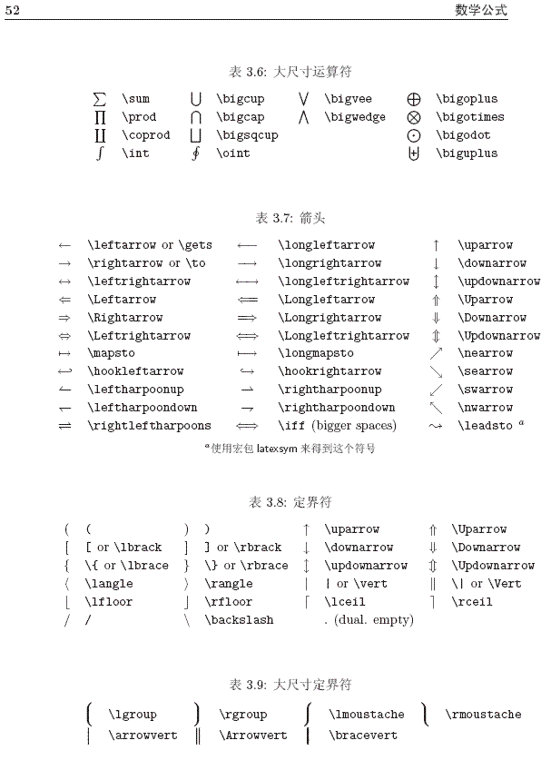
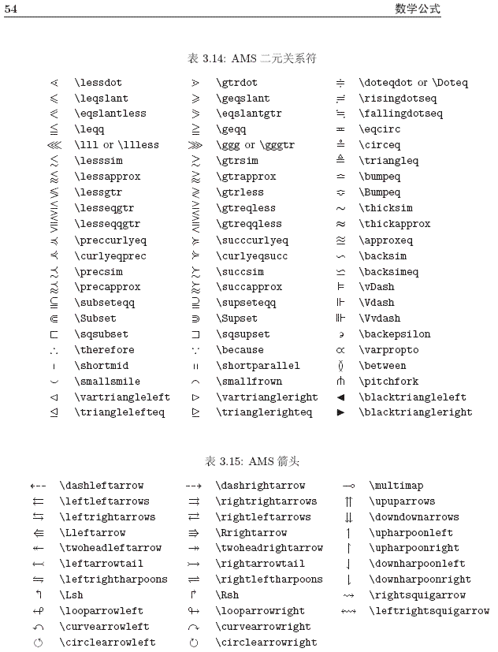

## 上下标
- $a^{-\alpha}_{ij}$
- 也可以换顺序： $e_{k_1}^{x^2}$
- 有时大括号可以省略： $a_i^kw$ ，这时有效范围是单字母和1位数字。

## 分数
- $\frac{a_1}{b_1}$

3:

|||
|--|--|
|$\Leftrightarrow$|Leftrightarrow|$\leftrightarrow$|leftrightarrow|
|$\Leftarrow$|Leftarrow|$\leftarrow$|leftarrow|
|$\Rightarrow$|Rightarrow|$\rightarrow$|rightarrow|
|$\Longleftrightarrow$|Longleftrightarrow|...|

