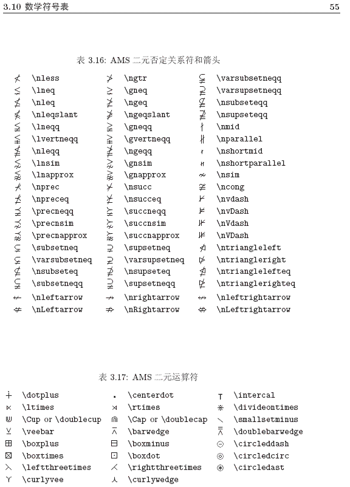
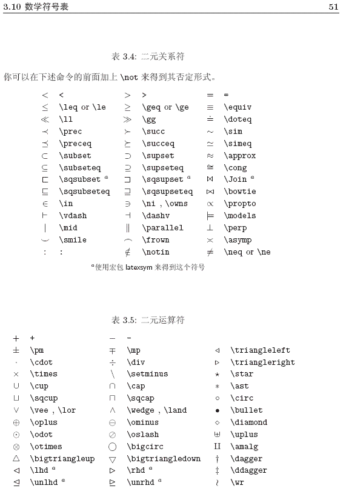
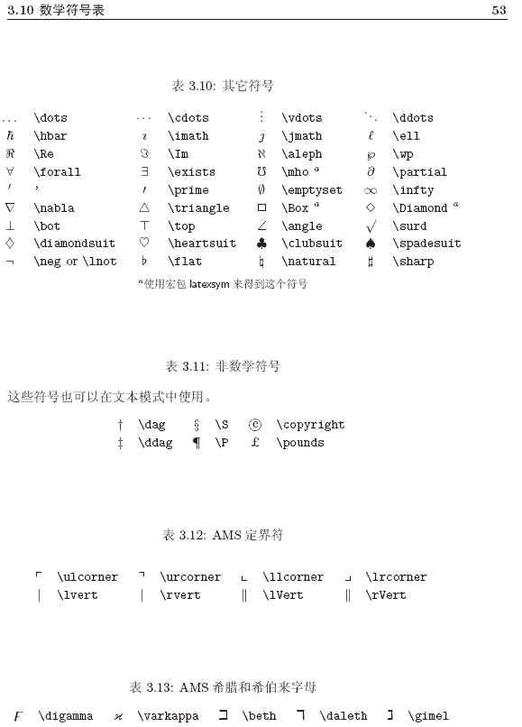

3:

|||
|--|--|
|$\Leftrightarrow$|Leftrightarrow|$\leftrightarrow$|leftrightarrow|
|$\Leftarrow$|Leftarrow|$\leftarrow$|leftarrow|
|$\Rightarrow$|Rightarrow|$\rightarrow$|rightarrow|
|$\Longleftrightarrow$|Longleftrightarrow|...|

