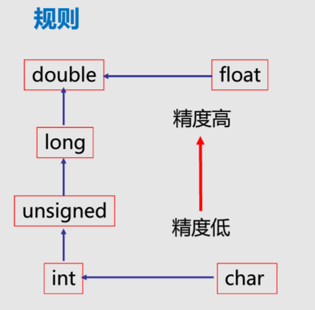

# 绪论
可计算：如果输入参数和输出参数的对应关系是明确的，则说明这个问题是可计算的。
有穷性
确定性


单引号是字符常量，占一个字节
双引号是字符串常量，字符串末尾用用一个标识符占一个字节

符号常量
```
#define PI 3.14
```

# 变量的作用域

|存储类型|	生存期	|作用域|	说明|
|--|--|--|--|
auto(默认)|	函数内部|	函数内部|	默认是这个类型
register	|		|	|一直放在寄存器中的，通常形参和局部变量放这里面
static	|函数内部|	函数内部	|局部静态：在函数中定义  <br> 注意，定义并赋值时，赋值仅对第一次有效
static|	函数外部 |整个程序	|全局静态：在函数外定义
extern	|整个程序|	从定义到文件结束|	可以于局部变量同名，这时同名的外部变量不起作用
静态存储|	整个程序运行区间（全局，全局静态）			
动态存储|	函数结束立即释放空间（aoto register）			

# 运算符的优先顺序

<table class="tableizer-table">
<thead><tr class="tableizer-firstrow"><th>优先级</th><th>运算符</th><th>名称或含义</th><th>使用形式</th><th>结合方向</th><th>说明</th><th>&nbsp;</th></tr></thead><tbody>
 <tr><td>1</td><td>[ ]</td><td>数组下标</td><td>数组名[整型表达式]</td><td>左到右</td><td>&nbsp;</td><td>&nbsp;</td></tr>
 <tr><td>&nbsp;</td><td>( )</td><td>圆括号</td><td>（表达式）/函数名(形参表)</td><td>&nbsp;</td><td>&nbsp;</td><td>&nbsp;</td></tr>
 <tr><td>&nbsp;</td><td>.</td><td>成员选择（对象）</td><td>对象.成员名</td><td>&nbsp;</td><td>&nbsp;</td><td>&nbsp;</td></tr>
 <tr><td>&nbsp;</td><td>-></td><td>成员选择（指针）</td><td>对象指针->成员名</td><td>&nbsp;</td><td>&nbsp;</td><td>&nbsp;</td></tr>
 <tr><td>2</td><td>-</td><td>负号运算符</td><td>-表达式</td><td>右到左</td><td>单目运算符</td><td>&nbsp;</td></tr>
 <tr><td>&nbsp;</td><td>(类型)</td><td>强制类型转换</td><td>(数据类型)表达式</td><td>&nbsp;</td><td>&nbsp;</td><td>&nbsp;</td></tr>
 <tr><td>&nbsp;</td><td>++</td><td>自增运算符</td><td>++变量名/变量名++</td><td>&nbsp;</td><td>单目运算符</td><td>&nbsp;</td></tr>
 <tr><td>&nbsp;</td><td>--</td><td>自减运算符</td><td>--变量名/变量名--</td><td>&nbsp;</td><td>单目运算符</td><td>&nbsp;</td></tr>
 <tr><td>&nbsp;</td><td>*</td><td>取值运算符</td><td>*指针表达式</td><td>&nbsp;</td><td>单目运算符</td><td>&nbsp;</td></tr>
 <tr><td>&nbsp;</td><td>&</td><td>取地址运算符</td><td>&左值表达式</td><td>&nbsp;</td><td>单目运算符</td><td>&nbsp;</td></tr>
 <tr><td>&nbsp;</td><td>!</td><td>逻辑非运算符</td><td>!表达式</td><td>&nbsp;</td><td>单目运算符</td><td>&nbsp;</td></tr>
 <tr><td>&nbsp;</td><td>~</td><td>按位取反运算符</td><td>~表达式</td><td>&nbsp;</td><td>单目运算符</td><td>取补</td></tr>
 <tr><td>&nbsp;</td><td>sizeof</td><td>长度运算符</td><td>sizeof 表达式/sizeof(类型)</td><td>&nbsp;</td><td>&nbsp;</td><td>&nbsp;</td></tr>
 <tr><td>3</td><td>/</td><td>除</td><td>表达式/表达式</td><td>左到右</td><td>双目运算符</td><td>&nbsp;</td></tr>
 <tr><td>&nbsp;</td><td>*</td><td>乘</td><td>表达式*表达式</td><td>&nbsp;</td><td>双目运算符</td><td>&nbsp;</td></tr>
 <tr><td>&nbsp;</td><td>%</td><td>余数（取模）</td><td>整型表达式%整型表达式</td><td>&nbsp;</td><td>双目运算符</td><td>&nbsp;</td></tr>
 <tr><td>4</td><td>+</td><td>加</td><td>表达式+表达式</td><td>左到右</td><td>双目运算符</td><td>&nbsp;</td></tr>
 <tr><td>&nbsp;</td><td>-</td><td>减</td><td>表达式-表达式</td><td>&nbsp;</td><td>双目运算符</td><td>&nbsp;</td></tr>
 <tr><td>5</td><td><<</td><td>左移</td><td>表达式<<表达式</td><td>左到右</td><td>双目运算符</td><td>溢出的丢弃，不足的补0</td></tr>
 <tr><td>&nbsp;</td><td>>></td><td>右移</td><td>表达式>>表达式</td><td>&nbsp;</td><td>双目运算符</td><td>&nbsp;</td></tr>
 <tr><td>6</td><td>></td><td>大于</td><td>表达式>表达式</td><td>左到右</td><td>双目运算符</td><td>&nbsp;</td></tr>
 <tr><td>&nbsp;</td><td>>=</td><td>大于等于</td><td>表达式>=表达式</td><td>&nbsp;</td><td>双目运算符</td><td>&nbsp;</td></tr>
 <tr><td>&nbsp;</td><td><</td><td>小于</td><td>表达式<表达式</td><td>&nbsp;</td><td>双目运算符</td><td>&nbsp;</td></tr>
 <tr><td>&nbsp;</td><td><=</td><td>小于等于</td><td>表达式<=表达式</td><td>&nbsp;</td><td>双目运算符</td><td>&nbsp;</td></tr>
 <tr><td>7</td><td>==</td><td>等于</td><td>表达式==表达式</td><td>左到右</td><td>双目运算符</td><td>&nbsp;</td></tr>
 <tr><td>&nbsp;</td><td>!=</td><td>不等于</td><td>表达式!= 表达式</td><td>&nbsp;</td><td>双目运算符</td><td>&nbsp;</td></tr>
 <tr><td>8</td><td>&</td><td>按位与</td><td>整型表达式&整型表达式</td><td>左到右</td><td>双目运算符</td><td>位逻辑与</td></tr>
 <tr><td>9</td><td>^</td><td>按位异或</td><td>整型表达式^整型表达式</td><td>左到右</td><td>双目运算符</td><td>位逻辑非</td></tr>
 <tr><td>10</td><td>|</td><td>按位或</td><td>整型表达式|整型表达式</td><td>左到右</td><td>双目运算符</td><td>位逻辑或</td></tr>
 <tr><td>11</td><td>&&</td><td>逻辑与</td><td>表达式&&表达式</td><td>左到右</td><td>双目运算符</td><td>&nbsp;</td></tr>
 <tr><td>12</td><td>||</td><td>逻辑或</td><td>表达式||表达式</td><td>左到右</td><td>双目运算符</td><td>&nbsp;</td></tr>
 <tr><td>13</td><td>?:</td><td>条件运算符</td><td>表达式1? 表达式2: 表达式3</td><td>右到左</td><td>三目运算符</td><td>&nbsp;</td></tr>
 <tr><td>14</td><td>=</td><td>赋值运算符</td><td>变量=表达式</td><td>右到左</td><td>&nbsp;</td><td>&nbsp;</td></tr>
 <tr><td>&nbsp;</td><td>/=</td><td>除后赋值</td><td>变量/=表达式</td><td>&nbsp;</td><td>&nbsp;</td><td>&nbsp;</td></tr>
 <tr><td>&nbsp;</td><td>*=</td><td>乘后赋值</td><td>变量*=表达式</td><td>&nbsp;</td><td>&nbsp;</td><td>&nbsp;</td></tr>
 <tr><td>&nbsp;</td><td>%=</td><td>取模后赋值</td><td>变量%=表达式</td><td>&nbsp;</td><td>&nbsp;</td><td>&nbsp;</td></tr>
 <tr><td>&nbsp;</td><td>+=</td><td>加后赋值</td><td>变量+=表达式</td><td>&nbsp;</td><td>&nbsp;</td><td>&nbsp;</td></tr>
 <tr><td>&nbsp;</td><td>-=</td><td>减后赋值</td><td>变量-=表达式</td><td>&nbsp;</td><td>&nbsp;</td><td>&nbsp;</td></tr>
 <tr><td>&nbsp;</td><td><<=</td><td>左移后赋值</td><td>变量<<=表达式</td><td>&nbsp;</td><td>&nbsp;</td><td>&nbsp;</td></tr>
 <tr><td>&nbsp;</td><td>>>=</td><td>右移后赋值</td><td>变量>>=表达式</td><td>&nbsp;</td><td>&nbsp;</td><td>&nbsp;</td></tr>
 <tr><td>&nbsp;</td><td>&=</td><td>按位与后赋值</td><td>变量&=表达式</td><td>&nbsp;</td><td>&nbsp;</td><td>&nbsp;</td></tr>
 <tr><td>&nbsp;</td><td>^=</td><td>按位异或后赋值</td><td>变量^=表达式</td><td>&nbsp;</td><td>&nbsp;</td><td>&nbsp;</td></tr>
 <tr><td>&nbsp;</td><td>|=</td><td>按位或后赋值</td><td>变量|=表达式</td><td>&nbsp;</td><td>&nbsp;</td><td>&nbsp;</td></tr>
 <tr><td>15</td><td>,</td><td>逗号运算符</td><td>表达式,表达式,...</td><td>左到右</td><td>从左向右顺序运算</td><td>value=value1,value2,value3取第一个，value=(value1,value2,value3)取最后一个</td></tr>
</tbody></table>

# 变量的内存占用
<table class="tableizer-table">
<thead><tr class="tableizer-firstrow"><th>类型说明符</th><th> 数的范围</th><th>分配字节数（1字节=8个二进制）</th></tr></thead><tbody>
 <tr><td>[signed] int</td><td>同short或long</td><td>&nbsp;</td></tr>
 <tr><td>unsigned[int]</td><td>同short或long</td><td>&nbsp;</td></tr>
 <tr><td>[signed]short [int]</td><td> -32768~32767</td><td>■■ </td></tr>
 <tr><td>unsigned short[int]</td><td>0~65535</td><td>■■ </td></tr>
 <tr><td>[signed] long [int]</td><td>-2147483648~2147483647</td><td>■■■■ </td></tr>
 <tr><td>unsigned long [int]</td><td> 0~4294967295</td><td>■■■■ </td></tr>
 <tr><td>float</td><td>-3.4e-38~3.4e38</td><td>■■■■ </td></tr>
 <tr><td>double</td><td>-1.7e-308~1.7e308</td><td>■■■■ ■■■■</td></tr>
 </tbody></table>

## float
4字节
- 小数部分3字节
    - 1位表示正负号
    - 23位表示数字
- 指数部分1字节
    - 1位表示正负号
    - 7位表示指数


# 变量类型转换


# 字符串末尾自动加"\0"

# 求余
a%b
1、结果符号与a相同
2、a和b都是int

# 自增和自减
可以提高运算效率
```
i++
++i
i--
--i
```

i++表示先使用i中的内容，然后自加1
++i表示先自加，然后使用i中的内容


复合运算符(仅仅是简化代码长度而已)
```
x+=n
x-=n
x*=n
x/=n
x%=n
```

# char
1、转义字符里 \ddd d为8进制，是ascii码所对应符号，一些键盘上没有的符号，可通过转义字符打出；
2、定义char，数与字母有着关系，ascii表；
3、char的内存为1字节，1089放入其中会溢出，取后8位，为65，而A的ascii码为65。


# 强制取整符号
(int)x

# 选择语句
if(条件){语句组;}
if(条件){语句1;}


”ab”比”abc”大吗？


(条件)?(表达式1):(表达式2)

x=(a>b)a:b

按位运算：既不进位，也不退位
```
&
|
^
~
```


# 字符串处理函数

# 预处理

宏定义
- 例子1：
```
#define 标示符    字符串
#define PI 3.1415926

#define 宏名（参数表） 字符串
```

- 例子2：
```
#define S(a,b) a*b
```


例题：

```
#include <stdio.h>
#include <stdlib.h>
#define X   5
#define Y    X+1
#define Z   Y*X/2
int main()
{
    int a; a=Y;
 printf("%3d",Z);
printf("%3d",--a);
return 0;
}

```
结果： 7 5

```
#define ADD(x) x+x
main( )
{  
    int m=1,n=2,k=3,sum;
    sum=ADD(m+n)*k;
    printf(“sum=%d\n”,sum);   
}
```

结果：10
