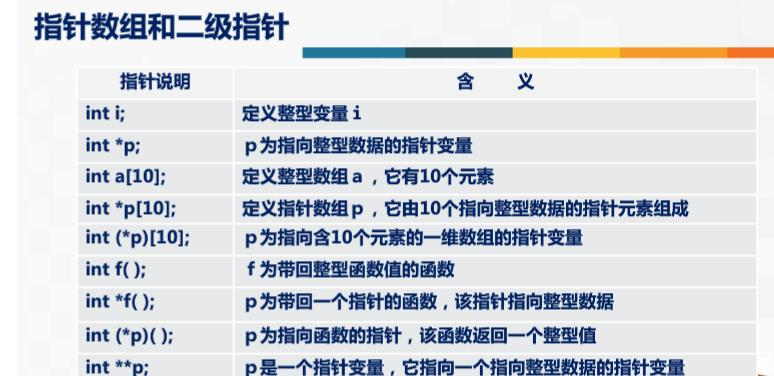

```C
#include <stdio.h>
#include <time.h>

int main() {
    char c;
    int n=0;
    time_t time1,time2;
    time(&time1);
    while(getchar()!='#')
    n++;
    time(&time2);

    printf("%d\n",n);
    printf("%f\n",time2-time1);

    return 0;
}
```

# 日历程序
```C
#include <stdio.h>
int main() {
    int a,b[13]= {0,31,28,31,30,31,30,31,31,30,31,30,31},n=4,i;
    scanf("%d",&a);
    printf("       %d年日历\n",a);
    for(a=1; a<=12; a++) {
        printf("\n\n");
        printf("        ");
        printf(" %d月\n\n 日 一 二 三 四 五 六\n",a);

        for(i=1; i<=3*n; i++)
            printf(" ");
        for(i=1; i<=b[a]; i++) {
            printf(" %2d",i);
            n++;
            if(n==7||i==b[a]) {
                printf("\n");
            }
            n%=7;
        }
    }
}
```

从键盘输入一个字符串，判断是否为对称字符串，若是输出“YES”，若不是输出“NO”

```C
#include<stdio.h>
#include<string.h>
int main()
{
    char str[100];
gets(str);
//printf("%s",str);
int i,j;
i=0;j=strlen(str)-1;

for(i,j;i<=j;i++,j--)
{
    if(str[i]!=str[j]){
        printf("NO");
        return 0;
    }
}
printf("YES");
return 0;
}
```

# 用指针排序

```C
#include <stdio.h>
#include <stdlib.h>
int my_swap(int *px,int *py) {
    int temp1;
    temp1=*px;
    *px=*py;
    *py=temp1;
    return 0;
}
int main() {
    int x[10];
    int i,j;
    for(i=0;i<10;i++)scanf("%d",x+i);
    for(i=0;i<9;i++){
        for(j=i;j<10;j++)
        {
            if(*(x+i)>*(x+j))my_swap(x+i,x+j);
        }
    }
    for(i=0;i<9;i++)printf("%d,",*(x+i));
    printf("%d",*(x+9));
    return 0;

}

```

```C
#include <stdio.h>

int main() {
    char *str="hello, world" ;
char a[]="I am a boy."


    printf("%d",str);实际上是简略的形式
    printf("%c",*(str+1));

    return 0;
}
```

# 二维数组
```
int a[3][4];
```
`a,*a,a[0],&a[0][0]`,是等效的，表示首地址
这是因为*a访问的是a[0]

`a+1,*(a+1),a[1],&a[1][0]`是等效的
a+1表示第一行的首地址 a[1]

`a[1]+2,&a[1][2]`是等效的

总结
表示|值
|--|--|
|a|二维数组名，指向一维数组a[0]的首地址|
|a[0],*(a+0),*a|0行0列元素的地址|
|a+1|&a[1]|1行首地址|
|a[1],*(a+1)|a[1][0]的地址|
|a[1]+2,*(a+1)+2,&a[1][2]|a[1][2]的地址|
|*(a[1]+2),*(*(a+1)+2),a[1][2]|a[1][2]的值|

# 另一种指针

```C
int (*p)[4];
p+i; //指向a[i]
```

# 指向函数的指针
```C
int (*pf)(int a[])
pf=&max

m=(*pf)(a)//用指针调用函数
```

# 函数return一个指针

```C
类型名 *函数名(参数)
```

调用：与普通无异

```C++
#include<stdio.h>
int funa(int a, int b)
     { return  a+b;}
int  funb(int a, int b)
     { return  a-b;}
int sub (int(*t)(int ,int ), int x, int y)
      { return (*t)(x,y);}
int main( )
   {   int  x,(*p)(int,int);
        p=&funa;
        x=sub(p,9,3);
        x+=sub(&funb,8,3);
        printf("%d\n",x);  
 }
```

**

# 指针数组

```C
char *p[5]={“wangxiao”,”zhangyi”,”wenhua”, ”chenxu”,”liming”};
```

# 指针的指针：二级指针


小技巧
```C
char *p="hello, world";
printf("%s",p);
//字符串可以直接用指针print
```




- 调用函数时，只能把实参的值传送给形参，形参的值不能传送给实参

- 语言程序中，如果变量做函数参数，则当函数调用时（   ）。
实参和形参各占一个独立的存储单元

- 可以有也可以没有形参


函数的return与函数的定义冲突时，以函数的定义为准


1.
若函数的形参为一维数组，则下列说法中正确的是（  B   ）。
A. 调用函数时的对应实参必为数组名
B. 形参数组可以不指定大小
C. 形参数组的元素个数必须等于实参数组的元素个数
D. 形参数组的元素个数必须多于实参数组的元素个数


# 指针

## 赋值法1
```
int x=2,*p=&x;
```

## 赋值法2
```
int x,*p;
px=&x;
```
注意：
```
int *p;指的是地址p对应的变量是int
```

1. 关于调用功能函数，实现两个变量值的交换，以下正确的是
A. 实参是指针，形参是变量名；
B. 实参是变量地址，形参是指针；
C. 实参是变量名，形参是变量名；
D. 实参是变量名，形参是地址。

正确答案： B 你选对了       

2. 以下叙述中正确的是           。
A. 指针定义后，可以指向同类型的任何变量。
B. 指针定义后，可以指向任何类型变量。
C. 指针定义后，可以用整型数据为指针初始化。
D. 指针定义后，只能指向一个变量。

正确答案： A 你选对了


数组指针
1、
```
int a[5],*p=&a
```
2、
```
int a[5],*p;
*p=a;
p=&a
```
3、int a[5]
a本身就是地址

`*(a+1)` 就是第二个数
